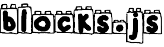

# 

Micro react-like, redux-compatible, plain JS library for event-driven ui components

## Features

* react-like
* jsx compatible
* minimal
* standard
* pure ES2015

## Installation

```
$ npm i --save blocksjs
```

## Examples

> A simple component

```javascript
import { $, mount, dom, Component } from 'blocks'

const hello = (name) =>
  dom('span', null, `Hello, ${ name }!`)

class Hello extends Component {
  render({ name }) {
    return hello(name)
  }
}

mount(Hello, $('#helloContainer'), { name: 'John Doe' })

```

> A simple component (jsx enabled)


Enable jsx
```
npm i --save-dev babel-plugin-transform-jsx
```

.babelrc
```json
{
  "presets": ["es2015"],
  "plugins": [
    ["transform-react-jsx", {
      "pragma": "dom"
    }]
  ]
}
```

```javascript
import { $, mount, dom, Component } from 'blocks'

class Hello extends Component {
  render({ name }) {
    return (
      <span>
        Hello, {name}!
      </span>
    )
  }
}

mount(Hello, $('#helloContainer'), { name: 'John Doe' })

```

> A component with lifecycle callbacks

```javascript
import { $, mount, dom, Component } from 'blocks'

class Counter extends Component {
  increase() {
    this.setState({ count: this.state.count + 1 })
  }

  decrease() {
    this.setState({ count: this.state.count - 1 })
  }

  render({ count }) {
    return dom('span', {
      class: 'ribbon'
    }, [ count ])
  }
}

mount(Hello, $('#counterContainer'), { count: 42 })

```

> A slightly complex counter

Check out a [live exmaple](http://jsbin.com/torela/edit?js,output) (hit `Run with JS`)

```javascript
import { dom, Component } from 'blocks'

const ARROW_KEYS = {
  UP: 38,
  DOWN: 40
}

const button = (label, onClick) =>
  dom('button', { onClick }, label)

const counter = (n = 0) =>
  dom('div', {
    class: 'counter',
    style: `
      color: ${ n > 0 ? '#3c3' : '#c33' };
      background: ${ n > 0 ? '#cfc' : '#fcc' };
    `
  }, n)

const headsOrTails = () => Math.random() < .5

class CounterApp extends Component {
  onMount() {
    document.addEventListener('keyup', (e) => {
      switch(e.which) {
        case ARROW_KEYS.UP:
          this.increase()
          break
        case ARROW_KEYS.DOWN:
          this.decrease()
          break
      }
    })

    this.state.interval = setInterval(this.tick.bind(this), 1000)
  }

  onUnmount() {
    this.state.interval = clearInterval(this.state.interval)
  }

  increase() {
    this.setState({ count: this.state.count + 1})
  }

  decrease() {
    this.setState({ count: this.state.count - 1})    
  }

  tick() {
    return headsOrTails() ? this.increase() : this.decrease()
  }

  render({ count }) {
    return dom('div', { class: 'app' },
      button('-', this.decrease.bind(this)),
      counter(count),
      button('+', this.increase.bind(this))
    )
  }
}

mount(CounterApp, $('#appContainer'), { count: 10 })
```
